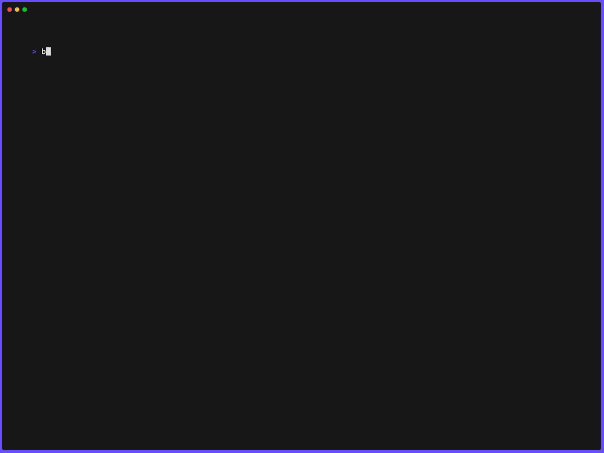

# ⚡ DCD - Deploy Docker Apps in Seconds, Not Hours

<div align="center">

[](https://crates.io/crates/dcd)
[](https://crates.io/crates/dcd)
[](https://github.com/g1ibby/dcd/stargazers)
[](https://opensource.org/licenses/MIT)
[](https://github.com/g1ibby/dcd/actions)

**The simplest way to deploy Docker Compose applications to any server**

*Stop wrestling with complex CI/CD. Start shipping faster.*

[🎯 Quick Start](#-quick-start) • [🔥 Features](#-why-developers-love-dcd) • [📖 Examples](#-real-world-examples) • [🛠️ Install](#-installation)

</div>

---

<div align="center">
  
  <p><em>Deploy your Docker app to production in one command ⚡</em></p>
</div>

## 💡 The Problem Every Developer Knows

You've built something amazing locally. `docker-compose up` works perfectly. Now you need to deploy it...

**Option 1: Managed Platforms** 🏢
- 💸 Expensive as you scale  
- 🔒 Vendor lock-in
- ⚙️ Limited customization
- 🚫 Not all apps supported

**Option 2: Complex CI/CD** 🤯
- 📚 Hours learning Kubernetes/Docker Swarm
- 🔧 Complex pipeline setup
- 🐛 More things to break
- ⏰ Weeks to get right

**What if there was a third way?** 🤔

## ✨ Meet DCD - Your Deploy Button for Any Server

DCD gives you the **simplicity of Heroku** with the **power of your own server**. Deploy Docker Compose apps to any VPS with a single command.

```bash
# That's it. Your app is live. 🎉
dcd up user@your-server.com
```

**Perfect for:**
- 🏗️ Personal projects that outgrew localhost
- 💡 Side hustles that need production deployment  
- 🚀 Startups wanting infrastructure control
- 👨‍💻 Developers who value simplicity over complexity

## 🔥 Why Developers Love DCD

### 🎯 **Zero Configuration Deployment**
No YAML hell, no pipeline setup. If it runs with `docker-compose`, it deploys with DCD.

### ⚡ **Lightning Fast**
From code change to live production in under 30 seconds. No build queues, no waiting.

### 🔒 **Your Infrastructure, Your Rules**
Deploy to any Linux server you control. Keep your data, control your costs.

### 🔄 **GitHub Actions Ready**
Drop-in action for automatic deployments. Perfect CI/CD in 5 lines of YAML.

### 💰 **Save Money**
$5/month VPS vs $20+/month managed platform. DCD pays for itself immediately.

## 🚀 Quick Start

### Install DCD
```bash
cargo install dcd
```

*Or download from [releases](https://github.com/g1ibby/dcd/releases)*

### Deploy Your First App
```bash
# 1. Have a docker-compose.yml? ✅
# 2. Have SSH access to a server? ✅  
# 3. Deploy!
dcd up user@your-server.com

# That's literally it. Your app is live! 🎉
```

### Setup Automatic Deployments
Add this to `.github/workflows/deploy.yml`:

```yaml
- name: Deploy to production  
  uses: g1ibby/dcd/dcd-deploy@v1
  with:
    target: ${{ secrets.SSH_USER }}@${{ secrets.SSH_HOST }}
    ssh_private_key: ${{ secrets.SSH_PRIVATE_KEY }}
```

**Push to main = instant deployment** ⚡

## 🌟 Real-World Success Story

### Why I Built DCD - My HomeLLM Deployment Story

I created DCD to solve my own deployment frustrations while building [HomeLLM](https://github.com/g1ibby/homellm) - a self-hosted AI platform with Open WebUI, LiteLLM proxy, PostgreSQL, and Traefik.

**The Pain Before DCD:**
Every deployment was a manual nightmare:
```bash
ssh user@my-server.com
cd /opt/homellm
git pull origin main
docker-compose down
docker-compose pull
docker-compose up -d
```

This process took 5-10 minutes and often failed. I avoided deploying updates, which meant bugs stayed unfixed and features took weeks to reach production.

**After Building DCD:**
```bash
dcd up user@my-server.com
```

**The transformation:**
- ⚡ **10x faster**
- 🔄 **100% reliable**  
- 🚀 **Deploy confidence**
- 🎯 **Focus on features**

[**See the live deployment workflow →**](https://github.com/g1ibby/homellm/blob/main/.github/workflows/deploy.yml)

Now HomeLLM automatically deploys every time I push to main. What used to be a stressful weekend task is now a seamless part of my development flow.


## 🔥 Real-World Examples

### The Side Project That Became Profitable

**Before DCD:**
```bash
# Every deployment was a nightmare
ssh user@server
git pull
docker-compose down
docker-compose pull  
docker-compose up -d
```

**With DCD:**
```bash
dcd up user@server
```

**Result:** Went from deploying once a week (too scary) to deploying multiple times per day. Shipped features faster, caught bugs earlier, grew revenue 3x.

## 🎯 Perfect For Your Stack

### ✅ **What Works Great**
- 🐳 Any Docker Compose app
- 🌐 Web apps (React, Vue, Next.js...)  
- 🗄️ Full-stack apps with databases
- 🤖 AI/ML applications
- 📊 Data analytics platforms
- 🔗 API services and microservices

### ✅ **Supported Platforms**
- 🐧 Ubuntu/Debian servers
- ☁️ Any VPS (DigitalOcean, Linode, AWS EC2...)
- 🏠 Self-hosted servers
- 🔒 Private infrastructure

## 🛠️ Advanced Features

<details>
<summary><strong>📋 Full Command Reference</strong></summary>

### Commands
- `dcd analyze` - Preview what will be deployed
- `dcd up <target>` - Deploy or update your app
- `dcd status <target>` - Check deployment status  
- `dcd destroy <target>` - Clean removal

### Global Options
```bash
-f, --file <FILES>...       Docker Compose files
-e, --env-file <FILES>...   Environment files  
-i, --identity <KEY>        SSH private key
-w, --workdir <DIR>         Remote working directory
-v, --verbose               Debug output
```

### Examples
```bash
# Multiple compose files
dcd -f docker-compose.yml -f docker-compose.prod.yml up user@server

# Custom SSH key and port
dcd -i ~/.ssh/deploy_key up user@server.com:2222

# Different environment
dcd -e .env.production up user@prod-server.com
```

</details>

<details>
<summary><strong>🔄 GitHub Actions Integration</strong></summary>

### Basic Setup
```yaml
name: Deploy
on:
  push:
    branches: [main]
    
jobs:
  deploy:
    runs-on: ubuntu-latest
    steps:
      - uses: actions/checkout@v4
      - uses: g1ibby/dcd/dcd-deploy@v1
        with:
          target: ${{ secrets.SSH_USER }}@${{ secrets.SSH_HOST }}
          ssh_private_key: ${{ secrets.SSH_PRIVATE_KEY }}
```

### Advanced Configuration
```yaml
- uses: g1ibby/dcd/dcd-deploy@v1
  with:
    command: up
    target: ${{ secrets.SSH_USER }}@${{ secrets.SSH_HOST }}
    compose_files: "docker-compose.yml docker-compose.prod.yml"
    env_files: ".env.prod"
    ssh_private_key: ${{ secrets.SSH_PRIVATE_KEY }}
    remote_dir: "/opt/myapp"
    no_health_check: false
```

### Environment Management
```yaml
jobs:
  deploy:
    environment: production  # GitHub environment with secrets
    env:
      DATABASE_URL: ${{ secrets.DATABASE_URL }}
      API_KEY: ${{ secrets.API_KEY }}
```

</details>

<details>
<summary><strong>⚙️ Technical Details</strong></summary>

### How DCD Works
1. **Analyzes** your Docker Compose configuration locally
2. **Syncs** necessary files to your server via SSH/SFTP
3. **Installs** Docker if needed (optional)
4. **Deploys** using `docker compose up`
5. **Verifies** health checks pass
6. **Reports** success or failure

### File Synchronization
- Automatically detects referenced files in volumes
- Syncs only what's needed
- Preserves file permissions
- Creates backups before updates

### Environment Variables
- Scans compose files for variable usage
- Sources from local environment
- Generates `.env.dcd` file for remote deployment
- Secure handling of secrets

### Security
- Uses SSH key authentication
- Files transferred over encrypted SFTP
- No credentials stored on remote server
- Configurable working directories

</details>

## 🤝 Join the Community

### 🌟 **Show Your Support**
Star this repo if DCD helps your deployments! ⭐

### 🐛 **Found a Bug?**
[Open an issue](https://github.com/g1ibby/dcd/issues) - we respond fast!

### 💡 **Have Ideas?**
[Join discussions](https://github.com/g1ibby/dcd/discussions) and help shape DCD's future.

### 🔗 **Spread the Word**
- [Twitter](https://twitter.com/intent/tweet?text=Just%20discovered%20DCD%20-%20deploy%20Docker%20apps%20in%20seconds!%20https://github.com/g1ibby/dcd)
- [Reddit](https://www.reddit.com/submit?url=https://github.com/g1ibby/dcd&title=DCD%20-%20Deploy%20Docker%20Compose%20apps%20to%20any%20server%20in%20seconds)
- [Hacker News](https://news.ycombinator.com/submitlink?u=https://github.com/g1ibby/dcd&t=DCD%20-%20Deploy%20Docker%20Compose%20apps%20to%20any%20server%20in%20seconds)

## 📦 Installation

### Using Cargo
```bash
cargo install dcd
```

### Download Binary
Get the latest release for your platform:
- [Linux (x86_64)](https://github.com/g1ibby/dcd/releases)
- [macOS (Intel)](https://github.com/g1ibby/dcd/releases)  
- [macOS (Apple Silicon)](https://github.com/g1ibby/dcd/releases)

### Verify Installation
```bash
dcd --version
```

## 🚀 Ready to Deploy Faster?

Stop spending hours on deployment setup. Start shipping features.

```bash
# Install DCD
cargo install dcd

# Deploy your app
dcd up user@your-server.com

# Celebrate! 🎉
```

---

<div align="center">

**Made with ❤️ for developers who want to ship, not configure**

[🐛 Report Bug](https://github.com/g1ibby/dcd/issues) • [💡 Request Feature](https://github.com/g1ibby/dcd/discussions) • [📖 Documentation](CONTRIBUTING.md)

</div>

## 📝 Current Limitations

While DCD handles most Docker Compose deployments perfectly, there are a few current limitations:

- **Build Context**: Services using `build:` directive aren't supported yet. Use pre-built images from registries instead.
- **Platform Support**: Currently optimized for Debian/Ubuntu systems. Other Linux distributions may need adjustments.

---

<div align="center">
<sub>Built with 🦀 Rust for maximum performance and reliability</sub>
</div>
